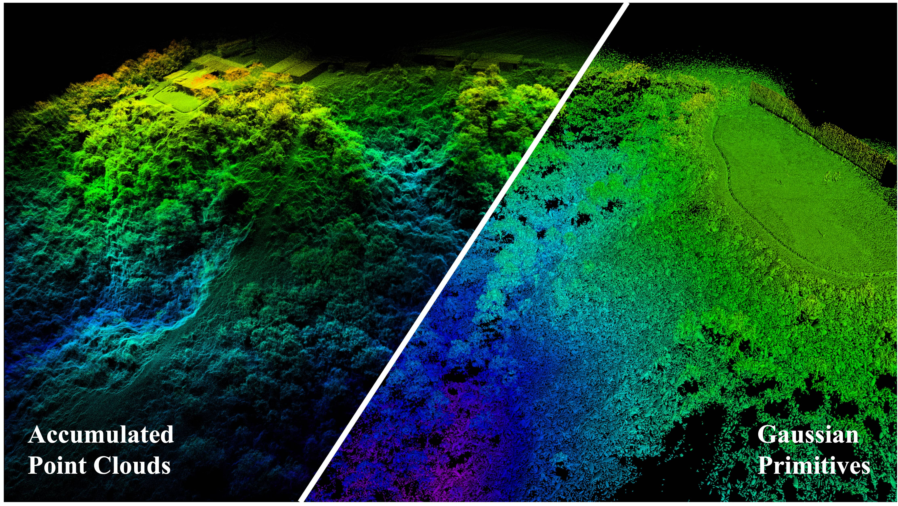
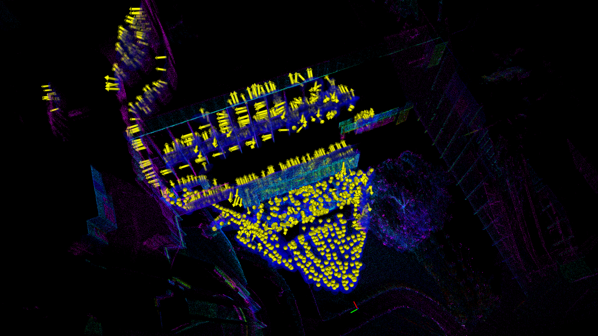
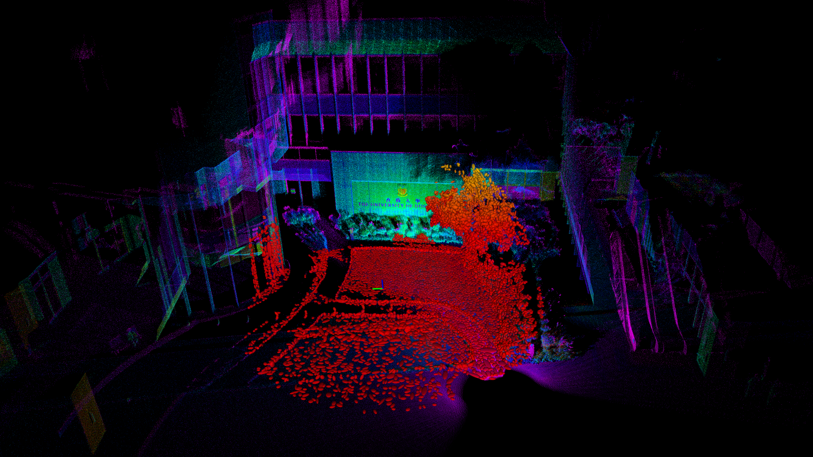

# AKF-LIO

## AKF-LIO: LiDAR-Inertial Odometry with Gaussian Map by Adaptive Kalman Filter

## 1. Introduction
Existing LiDAR-Inertial Odometry (LIO) systems typically use sensor-specific or environment-dependent measurement covariances during state estimation, leading to laborious parameter tuning and suboptimal performance in challenging conditions (e.g., sensor degeneracy and noisy observations). Therefore, we propose an Adaptive Kalman Filter (AKF) framework that dynamically estimates time-varying noise covariances of LiDAR and Inertial Measurement Unit (IMU) measurements, enabling context-aware confidence weighting between sensors. During LiDAR degeneracy, the system prioritizes IMU data while suppressing contributions from unreliable inputs like moving objects or noisy point clouds. Furthermore, a compact Gaussian-based map representation is introduced to model environmental planarity and spatial noise. A correlated registration strategy ensures accurate plane normal estimation via pseudo-merge, even in unstructured environments like forests. Extensive experiments validate the robustness of the proposed system across diverse environments, including dynamic scenes and geometrically degraded scenarios. Our method achieves reliable localization results across all MARS-LVIG sequences and ranks 8th on the KITTI Odometry Benchmark.

<div align="center">
    
</div>

### 1.1 Related video

Our accompanying video is now available on [**YouTube**](https://youtu.be/2o5CKeNb-7s).

### 1.2 Related paper

[AKF-LIO: LiDAR-Inertial Odometry with Gaussian Map by Adaptive Kalman Filter](https://arxiv.org/pdf/2503.06891)  

## Dependency

AKF-LIO is tested in Ubuntu 20.04. Please install the following libraries before compilation.
1. ROS noetic
2. glog: ```sudo apt-get install libgoogle-glog-dev```
3. eigen: ```sudo apt-get install libeigen3-dev```
4. pcl: ```sudo apt-get install libpcl-dev```
5. yaml-cpp: ```sudo apt-get install libyaml-cpp-dev```
   
## Compile

```bash
cd ~/catkin_ws/src
git clone https://github.com/xpxie/AKF-LIO.git
cd ..
catkin build
source devel/setup.bash (or source devel/setup.zsh)
```  
## Prepare the datasets

Download the rosbags to your local disk:

- [MARS-LVIG Dataset](https://mars.hku.hk/dataset.html)
- [ENWIDE Dataset](http://robotics.ethz.ch/~asl-datasets/2024_ICRA_ENWIDE/)

## Run AKF-LIO
MARS-LVIG Dataset

Please refer to the file "avia.yaml" for the number after "-s" and "-u" for different sequences.
```bash
roslaunch akf_lio avia.launch
rosbag play Featureless_GNSS03.bag -s 22 -u 1250 -r 3
```
ENWIDE Dataset
```bash
roslaunch akf_lio ouster.launch
rosbag play 2023-08-09-19-25-45-field_d.bag -r 3
```

## Visualization
To visualize our pseudo-merged plane and estimated normals, set "gaussian_publish_en" to True in YAML file. 
<div align="center">
    
</div>

To visualize Gaussian map, set both "gaussian_publish_en" and "map_publish_en" to True.
<div align="center">
    
</div>


# Acknowledgements

- We thank the authors of LOAM, [FastLIO2](https://github.com/hku-mars/FAST_LIO), [Faster-LIO](https://github.com/gaoxiang12/faster-lio) for their great works.
- Please cite our work if you are using AKF-LIO in academic work. Bibtex is provided here:

```
@article{xie2025akf,
  title={AKF-LIO: LiDAR-Inertial Odometry with Gaussian Map by Adaptive Kalman Filter},
  author={Xie, Xupeng and Geng, Ruoyu and Ma, Jun and Zhou, Boyu},
  journal={arXiv preprint arXiv:2503.06891},
  year={2025}
}
```

### Contact

If you have any questions, please feel free to contact: Xupeng XIE [xxieak@connect.ust.hk](mailto:xxieak@connect.ust.hk).